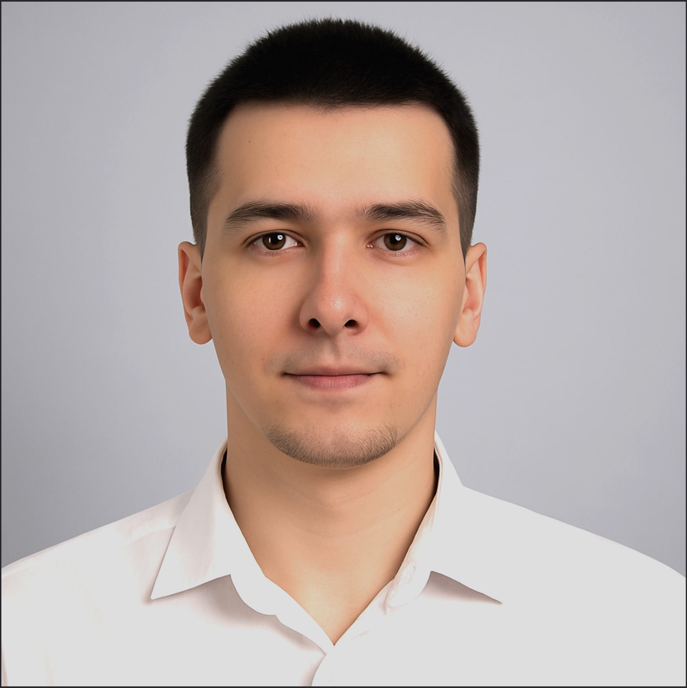

# Материлы по подготовке к ЕГЭ по информатике

Автор курса: Гимазетдинов Дмитрий Русланович

ТГ: [@devwhoami](https://t.me/s/devwhoami)

GitHub: [C4be](https://github.com/C4be)

<!-- Wait realize -->
<!-- 

*фото сгенерировано нейросетью, т.к. у автора нет нормальных фоток ^_^* -->

## О чем курс?

## Содержание курса

Ваше изучение я предлагаю начать с курса по основам Python для ЕГЭ - [/python_basics](./python_basics/), т.к. в этом курсе имеется все необходимое для самостоятельное подготовки: понятная теория + качественные упражнения.

### Python Basics

Подробнее [тут](./python_basics/README.md)

1. Ввод/вывод данных, работа с переменными, методы работы со строками.
2. Конструкция условия `if`

### EGE Core

Подробнее [тут](./ege_core/README.md)

В этом модуле начинается разбор всех заданий на ЕГЭ, в каждом номере вы найдете оценку задачи на сложность, трудозатратой на время и разделением на категории задач и сложности и разделением на актуальность.

1. will be soon
2. [Построение таблиц истинности логических выражений](./ege_core/2/README.md)
3. will be soon
4. [Кодирование и декодирование информации](./ege_core/4/README.md)
5. [Анализ и построение алгоритмов для исполнителей](./ege_core/5/README.md)
6. will be soon
7. will be soon
8. will be soon
9. will be soon
10. will be soon
11. will be soon
12. will be soon
13. will be soon
14. will be soon
15. will be soon
16. will be soon
17. will be soon
18. will be soon
19. will be soon
20. will be soon
21. will be soon
22. will be soon
23. will be soon
24. will be soon
25. will be soon
26. will be soon
27. will be soon

## Дополнительные материалы, мой выбор:

1. Если охото решать нестандартные задачи, немного повышенного уровня или актуальные:
   1. [Поляков](https://kpolyakov.spb.ru/school/ege.htm)
   2. [ФИПИ](https://ege.fipi.ru/bank/index.php?proj=B9ACA5BBB2E19E434CD6BEC25284C67F)
2. Нарешивание стандартных задач и первое знакомство:
   1. [Решу ЕГЭ](https://inf-ege.sdamgia.ru)
   2. [Школково](https://3.shkolkovo.online/catalog?SubjectId=30)
3. Послушать: 
   1. [Информатик БУ](https://www.youtube.com/@infbu)
   2. [Основы Python МФТИ](https://youtube.com/playlist?list=PLRDzFCPr95fK7tr47883DFUbm4GeOjjc0&si=AJoKGlLDy_lNdhqw)
4. Почитать мой курс, но если будет мало:
   1. [Yandex Python](https://education.yandex.ru/handbook/algorithms)
   2. [Yandex Алгоритмы](https://education.yandex.ru/handbook/algorithms)